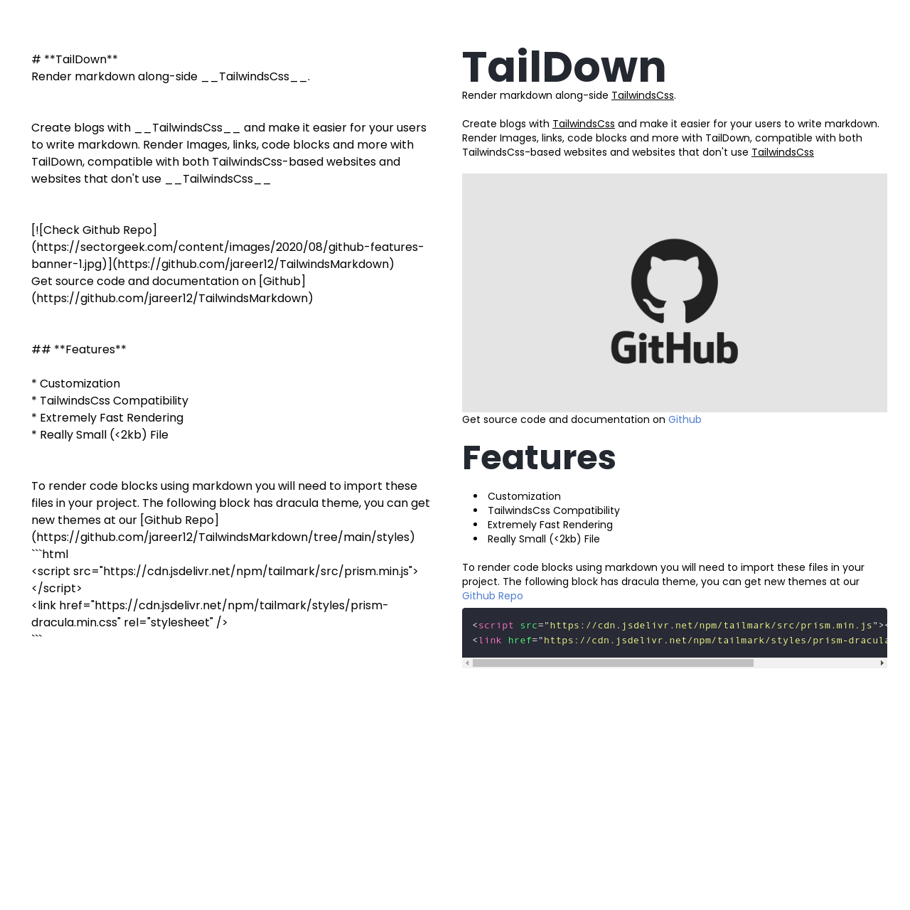

# Markdown For Tailwinds

## Install

```html
<!-- Main File -->
<script src="https://cdn.jsdelivr.net/npm/tailmark/src/taildown.min.js"></script>
<!-- For Code Snippets -->
<script src="https://cdn.jsdelivr.net/npm/tailmark/src/prism.min.js"></script>
<link
  href="https://cdn.jsdelivr.net/npm/tailmark/styles/dracula.min.css"
  rel="stylesheet"
/>
```

## Usage

create the class.

```js
Markdown = new TailDown();
```

To parse, use the `.parse()` function.

```js
MarkdownCode = `
# Blog Post
`;
HTML = Markdown.parse(MarkdownCode);
console.log(HTML);
```

If you are using the `<pre>` tag, you can highlight the code by.

```js
Prism.highlightAll();
// OR
Markdown.highlightAll();
```

If your code has HTML in it that you need to encode you can use `escapeHTML`

```js
Markdown = new TailDown({ escapeHTML: true });
```

## Config

This is how you can put custom class/style in any tag.

```js
Markdown = new TailDown({
  a: {
    customClass: "hover:text-blue-500",
    extendStyle: "display: block;",
  },
  h3: {
    customClass: "text-gray-600",
    extendStyle: "display: block;",
  },
});
```

Code snippet(`<pre>`) themes are in [The theme folder](./styles).

